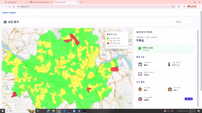
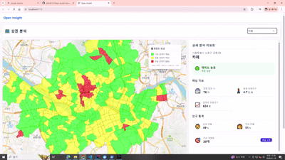

# [Open Insight] 상권 현황 대시보드

> 공공데이터를 활용하여 **상권 밀도, 유동인구, 경쟁 현황**을 시각화하고, 예비 창업자의 합리적인 의사결정을 돕는 **분석 대시보드** 풀스택 웹 애플리케이션입니다.

 

## 프로젝트 소개

- **기획 의도:** 특정 지역에서 창업시, 유동 인구와 지역 내 동일 업종 점포 수를 바탕으로 해당 업종이 지역 내에서 레드오션인지 블루 오션인지 판단하는데 필요한 정보를 제공합니다.
- **개발 기간:** 2025.11.28 ~ 2025.12.31
- **인원:** 1인

 

## 기술 스택

안정적인 서비스 운영과 대용량 공공데이터의 유연한 처리를 위해 **Spring Boot**와 **Python**을 결합한 하이브리드 아키텍처를 채택했습니다.

| 분류 | 기술 스택 | 상세 내용 |
| --- | --- | --- |
| **Backend** | **Java 17, Spring Boot 3.5.8** | RESTful API 설계, 대용량 트래픽 처리를 위한 견고한 서버 구축 |
| **ORM / DB** | **JPA, QueryDSL, MariaDB** | 복잡한 상권 검색 동적 쿼리 처리 및 데이터 무결성 보장 |
| **Cache** | **Redis, Docker** | 상권 통계 데이터 캐싱으로 조회 성능 최적화 및 컨테이너 기반 인프라 |
| **Data ETL** | **Python, Pandas, Asyncio** | `aiohttp`를 활용한 공공데이터 고속 비동기 수집 및 전처리 |
| **Frontend** | **React 19, TypeScript, Vite** | 컴포넌트 기반 대시보드 설계 및 빠른 빌드/렌더링 |
| **State/API** | **Axios, React Hooks** | 커스텀 훅(`useInitialData`, `useMarketMap`)을 통한 비즈니스 로직 분리 |
| **UI/UX** | **Tailwind CSS, daisyUI** | 직관적인 데이터 표현을 위한 유틸리티 퍼스트 디자인 |
| **Visual** | **Chart.js, Kakao Map SDK** | 행정동별 유동인구 히트맵(Polygon) 및 비교 분석 차트 시각화 |

 

## 시스템 구조

1. **ETL Pipeline (Python):** * `aiohttp`를 이용해 서울시 열린데이터 광장(유동인구) 및 공공데이터포털(상가정보) API에서 데이터를 비동기로 수집합니다.

2. **API Service (Spring Boot):** * 사용자가 특정 지역/업종을 조회하면 QueryDSL을 통해 조건에 맞는 통계 데이터를 추출합니다.

3. **Client (React):** * GeoJSON을 활용하여 지도 위에 **업소 밀도**와 **유동인구 분포**를 폴리곤(Polygon) 형태로 렌더링합니다.

 

## ✨ 핵심 기능 (Key Features)

### 📊 1. 상권 밀도 및 경쟁 현황 분석

* **업소 밀도 시각화:** 선택한 행정동 내 동일 업종 점포 수를 집계하여 경쟁 강도를 지도 위에 색상으로 표현합니다.
* **상세 리포트:** 사이드 패널을 통해 선택한 지역의 구체적인 점포 수, 전월 대비 증감률 등을 제공합니다.

### 🗺️ 2. 유동인구 히트맵 (Population Heatmap)

* 행정동별 유동인구 데이터를 **3단계(🟢여유, 🟡보통, 🔴밀집)** 색상 코드로 구분합니다.

### 📈 3. 데이터 리포트

* **Chart.js**를 활용하여 성별/연령별 유동인구 비율을 시각화합니다.

 

## 시연

 

업종을 선택하면, 서울시 지도 위에 색깔로 구분된 해당 업종의 포화도를 표시해, 해당 지역 내에서 업종별 경쟁 상황을 직관적으로 알 수 있습니다.

 

해당 지역의 상세한 정보를 알고 싶다면 지도에 표시된 지역을 클릭하면 됩니다. 그럼 지도 우측에 선택한 업종의 점포가 지역 내에 얼마나 있는지, 해당 지역의 유동인구, 남녀비, 주요 연령층 등의 정보를 보여줍니다.

## 👨‍💻 Developer

**alstn9213**
  - GitHub: https://github.com/alstn9213
  - Velog: https://velog.io/@kms0425/posts
  - Email: alstn9213@naver.com

